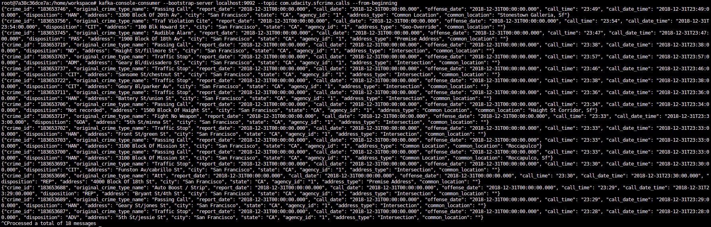
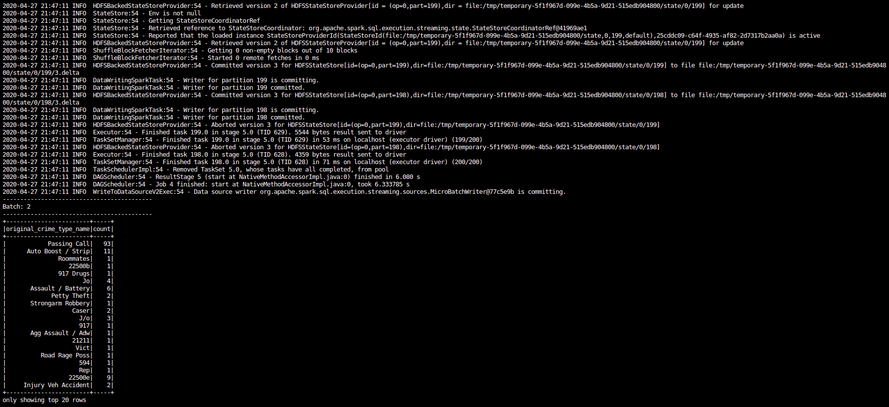
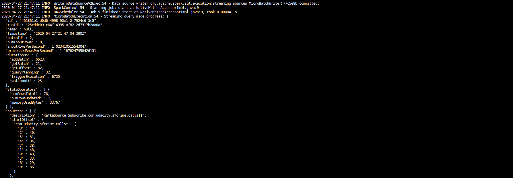
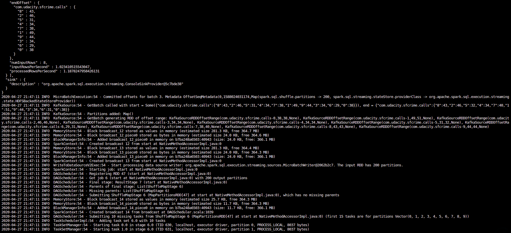
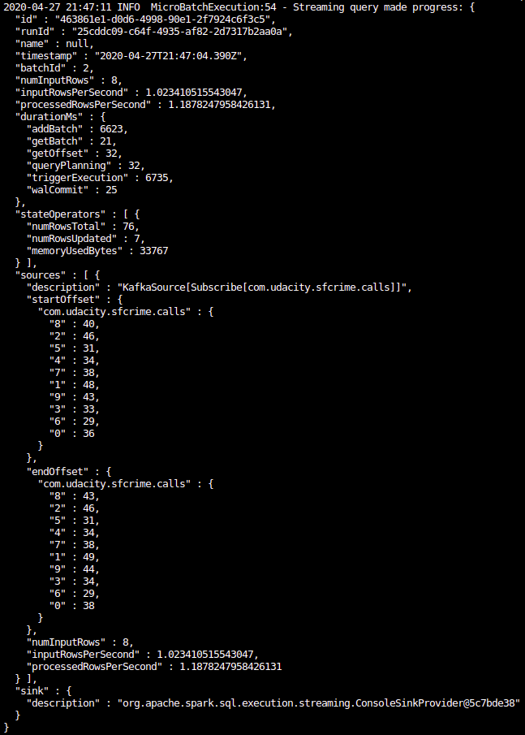
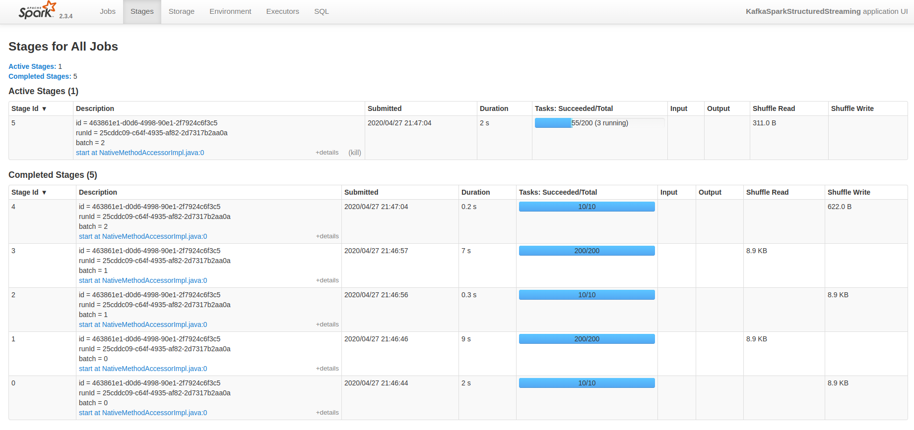

# SF Crime Statistics with Spark Streaming

The code of this repo is related to second project of [Udacity Data Streaming Nanodegree](https://www.udacity.com/course/data-streaming-nanodegree--nd029).

## Project overview

In this project, you will be provided with a real-world dataset, extracted from Kaggle, on San Francisco crime incidents, and you will provide statistical analyses of the data using Apache Spark Structured Streaming. You will draw on the skills and knowledge you've learned in this course to create a Kafka server to produce data, and ingest data through Spark Structured Streaming.

## Development Environment

These are the environment requirements to run the project.

* Spark 2.4.3
* Scala 2.11.x
* Java 1.8.x
* Kafka build with Scala 2.11.x
* Python 3.6.x or 3.7.x

The project was developed and tested inside the workspace provided by Udacity.

## Running the project

First thing to do is to start the Zookeeper server and Kafka server in a terminal window using the properties files inside `config` folder.

`/usr/bin/zookeeper-server-start config/zookeeper.properties &`

`/usr/bin/kafka-server-start config/server.properties &`

The Zookeeper produce several logs after started. The last one indicates the host and port used:

```
[2020-04-27 22:14:22,889] INFO binding to port 0.0.0.0/0.0.0.0:2181 (org.apache.zookeeper.server.NIOServerCnxnFactory)
```

Kafka server produce many logs too during the startup. You can check if some of the last are like:

```
[2020-04-27 22:16:54,122] INFO Kafka version : 2.1.1-cp3 (org.apache.kafka.common.utils.AppInfoParser)
[2020-04-27 22:16:54,125] INFO Kafka commitId : 74487c928927908f (org.apache.kafka.common.utils.AppInfoParser)
[2020-04-27 22:16:54,182] INFO Cluster ID: xy6NC1zWQSS4urHWAjYBow (org.apache.kafka.clients.Metadata)
```

Having the two servers running it's time to create the topic in Kafka where the police department calls will arrive. The topic can be created using Kafka CLI:

`kafka-topics --create --zookeeper localhost:2181 --topic com.udacity.sfcrime.calls --replication-factor 1 --partitions 10`

This will produce a result like:

```
Created topic "com.udacity.sfcrime.calls".
```

Now you can run the script which simluates the police calls and write into the topic:

`python kafka_server.py`

If you want to check if data is being written in the topic you can use the Kafka CLI:

`kafka-console-consumer --bootstrap-server localhost:9092 --topic com.udacity.sfcrime.calls --from-beginning`

**Step 1 - Kafka Consumer Console Output**



Finally you can run the main Spark Streaming process which pulls data from the topic. You need to set the Kafka dependency and the Spark UI port as arguments of the call:

`spark-submit --packages org.apache.spark:spark-sql-kafka-0-10_2.11:2.3.4 --master local[*] --conf spark.ui.port=3000 data_stream.py`

The output of this command is a very huge amount of logs appearing at full speed. If you can keep some logs you can check that they repeat the same pattern every few seconds. That's because it's processing a micro batch of the stream each time and calculating the aggregation of its data.

Here you can see an example of the console output:





The JSON showed in the middle part of the screenshot is the Progress Report:

**Step 2a - Progress Report**



Another way to see the progress of the execution process is using the Spark Streaming UI. There you can see all the jobs related to the processing of every batch of the stream:

**Step 2b - Spark Streaming UI**



**Step 3 - Questions**

***1. How did changing values on the SparkSession property parameters affect the throughput and latency of the data?***

You can see how changing some parameters the value of `processedRowsPerSecond` in the Progress Report is modified. Higer value is better because it means that more rows.

***2. What were the 2-3 most efficient SparkSession property key/value pairs? Through testing multiple variations on values, how can you tell these were the most optimal?***

You can try setting the `spark.default.parallelism` to some high value depending on the number of cores in your cluster. According the [documentation](https://spark.apache.org/docs/latest/tuning.html) a good value is 2-3 tasks per core.

Other property you can set is the `maxRatePerPartition` which is the maximum rate (number of records per second) at which data will be read from each Kafka partition when using the new Kafka direct stream API. You can think that this is a bad idea but if there is a lot of unprocessed messages you can make the processing more stable without overload the processors.

Making tests in the workspace environment setting the properties with the following values you can get 10 times more `processedRowsPerSecond` than without them.

* **maxRatePerPartition:** 10
* **spark.default.parallelism:** 600
